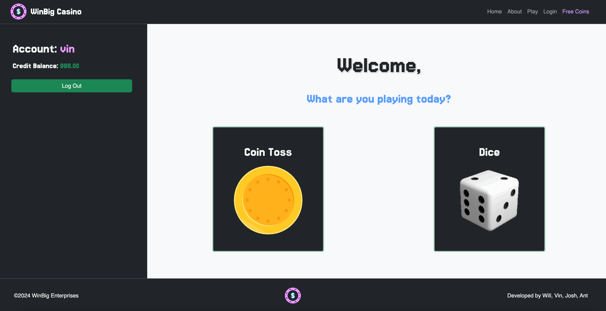
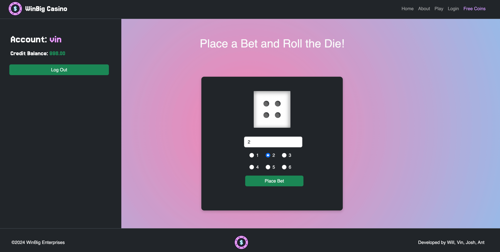
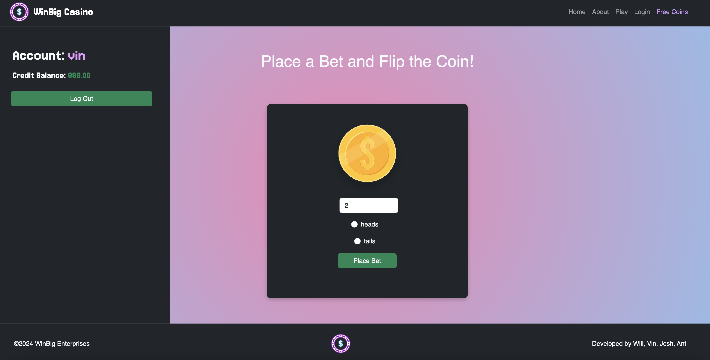

## Description
Welcome to WinBig, your ultimate destination for online gaming excitement! With WinBig, you can create an account, bet money on various games like coin flip or dice roll through an instant betting capability, and enjoy the thrill of winning big prizes! If you run out of coins, don't worry - you can play a fun random number game to win more and keep the excitement going.

## Table of Contents
[Features](#features) | [Deployment](#deployment) | [Technologies](#technologies) | [Usage](#usage) | [Credits](#credits) | [Contributions](#contributions) | [License](#license) | [Questions](#questions)

## Visuals

## Features
- Account Creation: Easily create your account to start playing (a registered user can also manage and update their account information, or even delete their account, on a user dashboard page).
- Multiple Games: Bet money on different games such as coin flip or dice roll (we plan on adding more games to the site, including a Wheel Spin game).
- Credits/Virtual Coin Management: Keep track of your coins and winnings.
- Random Number Game: Play a random number game to win more coins if you run out - We want our users to keep playing and have fun!

## Deployment
DEMO at Live URL: https://win-big-76ecc78832f3.herokuapp.com/

## Technologies
The following technologies were used within this project in order to make it a Full-Stack website/application:
- JavaScript
- CSS Bootstrap Framework
- Express.js
- Node.js
- Express Handlebars
- PostgreSQL
- Sequelize (and other various Node packages/modules used to connect to database or start a server, etc.

## Usage
To get started with WinBig, follow these steps:
1. Clone the repository from GitHub: git clone git@github.com:vgalante2/WinBig.git
2. Install dependencies: npm install
3. Set up the PostgreSQL database and configure the connection in the application.
4. Run the application: npm start
5. Visit http://localhost:3000 in your web browser to access WinBig.

## Credits
This Website application was created, designed, programmed and coded by William Gallagher, Vincent Galante, and Anthony Purificato.
- Rutgers Coding Bootcamp provided resources and support for completing this project, as it was a group project required to complete the course.
- OpenAI ChatGPT was utilized at some points for general coding assistance and aid upon encountering problems with code.

Game Credits:
Credit is due to the following code repositories, as they offered some starting code inspiration and ideas to use within our project. 
- Coin-Toss - [CoinToss]((https://www.geeksforgeeks.org/create-a-coin-toss-using-html-css-javascript/))
- Dice-Roll - [DiceRoll]((https://github.com/ryancperry))
- Wheel Spin - [WheelSpin]((https://codepen.io/GhostCode99/pen/BaQePwW))

## Contributions
Since this code is public and open-source, contributions are welcomed and even encouraged! Each of us creators of this application are enthusiastic for programming and enjoy learning new concepts and pushing the boundaries of our skills to become better programmers and developers.
- Feel free to clone and/or fork the code, or
- Open an issue to discuss what you would like to change.

## License
Website/Application is available for public use, hosted on Github servers, utilizing an MIT License - see the LICENSE file for details.

  
For more information on license please click the [Link](https://opensource.org/licenses/MIT)

## Questions
Check out my [GitHub](https://github.com/apurificato)
  
For additional questions, reach out to me on [LinkedIn](https://www.linkedin.com/in/apurificato/)

